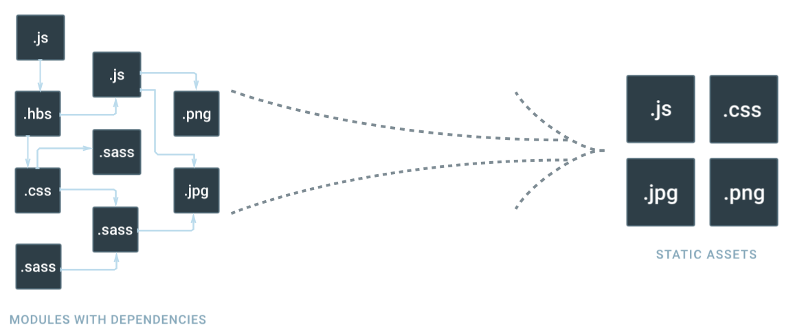

# Webpack entry和output
## 1. entry(入口)

webpack为应用中所有的依赖创建了关系图,关系图的起始点就是所谓的entry point。



enter配置项告诉Webpack应用的根模块或起始点在哪里。

### 1.1 单入口(single entry)语法

用法:entry: string|Array<string>

webpack.config.js

```
const config = {
  entry: './path/to/my/entry/file.js'
};

module.exports = config;
```

实际上，单入口语法的入口属性是下面的简写：

```
const config = {
  entry: {
    main: './path/to/my/entry/file.js'
  }
};
```

如果传递一个文件路径数组到entry属性叫做”multi-main entry”(多个入口)，
webpack将数组中的文件作为入口并把他们的依赖依赖关系合并成一个“块”(chunk)。

### 1.2 对象(object)语法

用法：entry: {[entryChunkName: string]: string|Array<string>}

webpack.config.js

```
const config = {
  entry: {
    app: './src/app.js',
    vendors: './src/vendors.js'
  }
};
```

对象语法更长，但是这是定义应用程序入口最容易扩展的方式。

下面是一些使用entry配置的例子

####  1.2.1分离应用程序(app)和供应商条目(vendors)

webpack.config.js

```
const config = {
  entry: {
    app: './src/app.js',
    vendors: ['jquery', 'lodash']
  },
  plugins: [
    new webpack.optimize.CommonsChunkPlugin({
        name: 'vendors',
        filename: 'vendor.min.js',
    })//需要配合CommonsChunkPlugin
  ]
};
```

module1.js

```
function f(a, b) {
    return a + ' ' + b;
}

var _ = require('lodash');

module.exports = _.curry(f);
```

app.js

```
var f = require('./module1');

var $ = require('jquery');

$("#app").text(f('hello')('world'));
```

打包结果

```
Hash: 9f00ee8be84fb578e1d4
Version: webpack 2.3.2
Time: 843ms
        Asset       Size  Chunks                    Chunk Names
       app.js  416 bytes       0  [emitted]         app
vendor.min.js     815 kB       1  [emitted]  [big]  vendors
   [0] ./~/jquery/dist/jquery.js 268 kB {1} [built]
   [1] ./~/lodash/lodash.js 540 kB {1} [built]
   [2] ./demo3/src/module1.js 110 bytes {0} [built]
   [3] ./demo3/src/app.js 97 bytes {0} [built]
   [4] (webpack)/buildin/global.js 509 bytes {1} [built]
   [5] (webpack)/buildin/module.js 517 bytes {1} [built]
   [6] multi jquery lodash 40 bytes {1} [built]
```

可以看到jquery和lodash两个第三方库都被打包到entryChunkName为vendors,文件名为vendor.min.js的文件块中。
而app.js和module1.js被打包到entryChunkName为app的文件块中，打包后的应用程序和第三方依赖文件块分离。

index.html中引用结果:

```
<script src="./vendor.min.js"></script>
<script src="./app.js"></script>
```

## 1.2.2 多页面应用程序

webpack.config.js

```
const config = {
  entry: {
    pageOne: './src/pageOne/index.js',
    pageTwo: './src/pageTwo/index.js',
    pageThree: './src/pageThree/index.js'
  }
};
```

我们告诉webpack 有3个单独的依赖图(就像上面的例子)。

在多页的应用程序中,打开一个新页时服务器将获取一个新的HTML文档。
网页重新载入新文档,同时资源也重新加载。这样我们可以使用CommonsChunkPlugin把各个页面共用的模块
抽离出来发布成单独的代码包。多页面重用共享的代码块，当entry增加时减少打包体积，
浏览器使用缓存也可以减少服务器请求体积。


## 2. output(出口)

一旦打包了所有的资源,我们仍然需要告诉webpack在哪打包应用程序。
webpack的output属性描述webpack如何去处理这些打包好的代码。

webpack.config.js

```
const path = require('path');

module.exports = {
  entry: './src/app.js',
   output: {
     filename: 'bundle.js',
     path: './dist'
   }
   // writes to disk: ./dist/bundle.js
};
```

上面的例子中，打包app.js文件，输出的bundle.js文件的路径为./dist/bundle.js。

output最少需要两个属性：

- filename:输出文件名。
- path:打包好的文件放置的绝对路径。

下面是output其他属性的用法

### 2.1 output.filename

指定磁盘上每个输出文件的名称。不能在此指定绝对路径，使用output.path选项
确定磁盘上的文件的位置。filename仅用于命名单个文件。

single entry

```
module.exports = {
  entry: './src/app.js',
  output: {
    filename: 'bundle.js',
    path: __dirname + '/build'
  }
  // writes to disk: ./build/bundle.js
}
```

multiple entries

如果配置创建了多个chunk(使用了多入口或者使用了CommonsChunkPlugin插件)，可以使用
文件名替换确保每一个输出文件都有唯一的文件名。

- [name] 使用chunk名作为输出文件名
- [hash] 使用编译文件的hash值作为文件名
- [chunkhash] 使用块文件的hash值作为文件名

```
module.exports = {
  entry: {
    app: './src/app.js',
    search: './src/search.js'
  },
  output: {
    filename: '[name].js',
    path: __dirname + '/build'
  }
  // writes to disk: ./build/app.js, ./build/search.js
}
```

### 2.2 output.path

output的path作为磁盘中的绝对目录(required).
publicPath作为app中使用的目录。

config.js

```
output: {
    path: "/home/proj/public/assets",
    publicPath: "/assets/"
}
```

index.html

```
<head>
  <link href="/assets/spinner.gif"/>
</head>
```

编译的路径就在path写的绝对路径里面，引用就可以通过publicPath写的路径引用了。