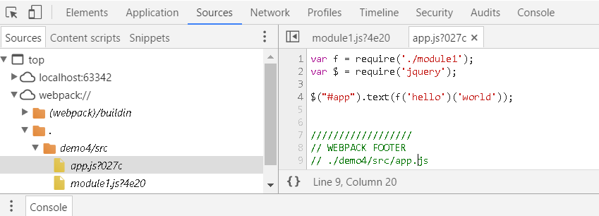
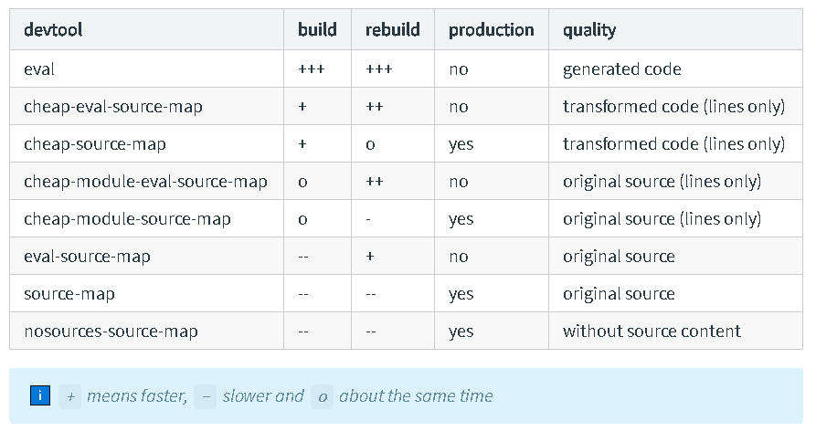

# 开发环境下的Webpack

前面说到了使用webpack将应用程序中零散的模块文件按依赖图打包成一个文件。
这种打包使用场景一般是生产环境(把打包好的文件上传到服务器)。但是在开发环境中调试打包的代码
十分困难。因为：

1. 每次修改需要重新打包
2. 打包文件经过转换和压缩可读性非常差


Webpack提供了几种开发工具供开发环境下打包编译模块。首先是生成Source Maps(代码源映射)

## 1. Source Maps

在开发过程中，经过转换编译后的代码调试非常困难。在浏览器中调试的时候能不能看到编译之前的源码呢？
Source Maps通过提供源码和转换后代码的映射来解决这个问题。
此外不仅仅是编译到js的源文件，编译到js的style也同样可以映射到源码。



webpack提供一个属性devtool来控制是否生成SourceMap还有生成什么样的源映射。

用法:devtool: string

```
module.exports = {
    devtool: 'eval'//source map生成的方式
};
```

### 1.1 devtool:'eval'

用eval方式生成的代码，每个模块都是包裹在eval方法中,模块的结尾直接把原文件地址添加进
@sourceURL,这种编译方式是最快的。

```
webpackJsonp([0],[
/* 0 */,
/* 1 */,
/* 2 */
/***/ (function(module, exports, __webpack_require__) {

eval("function f(a, b) {\r\n    return a + ' ' + b;\r\n}\r\n\r\nvar _ = __webpack_require__(1);\r\n\r\nmodule.exports = _.curry(f);\r\n\n\n//////////////////\n// WEBPACK FOOTER\n// ./demo4/src/module1.js\n// module id = 2\n// module chunks = 0\n\n//# sourceURL=webpack:///./demo4/src/module1.js?");

/***/ }),
/* 3 */
/***/ (function(module, exports, __webpack_require__) {

eval("var f = __webpack_require__(2);\r\nvar $ = __webpack_require__(0);\r\n\r\n$(\"#app\").text(f('hello')('world'));\n\n//////////////////\n// WEBPACK FOOTER\n// ./demo4/src/app.js\n// module id = 3\n// module chunks = 0\n\n//# sourceURL=webpack:///./demo4/src/app.js?");

/***/ })
],[3]);
```

### 1.2 devtool:'inline-source-map'

sourceMap作为dataurl的方式添加到编译后文件

```
webpackJsonp([0],[
/* 0 */,
/* 1 */,
/* 2 */
/***/ (function(module, exports, __webpack_require__) {

function f(a, b) {
    return a + ' ' + b;
}

var _ = __webpack_require__(1);

module.exports = _.curry(f);


/***/ }),
/* 3 */
/***/ (function(module, exports, __webpack_require__) {

var f = __webpack_require__(2);
var $ = __webpack_require__(0);

$("#app").text(f('hello')('world'));

/***/ })
],[3]);
//# sourceMappingURL=data:application/json;charset=utf-8;base64,eyJ2ZXJzaW9uIjozLCJzb3VyY2VzIjpbIndlYnBhY2s6Ly8vLi9kZW1vNC9zcmMvbW9kdWxlMS5qcyIsIndlYnBhY2s6Ly8vLi9kZW1vNC9zcmMvYXBwLmpzIl0sIm5hbWVzIjpbXSwibWFwcGluZ3MiOiI7Ozs7OztBQUFBO0FBQ0E7QUFDQTs7QUFFQTs7QUFFQTs7Ozs7OztBQ05BO0FBQ0E7O0FBRUEsb0MiLCJmaWxlIjoiYXBwLmpzIiwic291cmNlc0NvbnRlbnQiOlsiZnVuY3Rpb24gZihhLCBiKSB7XHJcbiAgICByZXR1cm4gYSArICcgJyArIGI7XHJcbn1cclxuXHJcbnZhciBfID0gcmVxdWlyZSgnbG9kYXNoJyk7XHJcblxyXG5tb2R1bGUuZXhwb3J0cyA9IF8uY3VycnkoZik7XHJcblxuXG5cbi8vLy8vLy8vLy8vLy8vLy8vL1xuLy8gV0VCUEFDSyBGT09URVJcbi8vIC4vZGVtbzQvc3JjL21vZHVsZTEuanNcbi8vIG1vZHVsZSBpZCA9IDJcbi8vIG1vZHVsZSBjaHVua3MgPSAwIiwidmFyIGYgPSByZXF1aXJlKCcuL21vZHVsZTEnKTtcclxudmFyICQgPSByZXF1aXJlKCdqcXVlcnknKTtcclxuXHJcbiQoXCIjYXBwXCIpLnRleHQoZignaGVsbG8nKSgnd29ybGQnKSk7XG5cblxuLy8vLy8vLy8vLy8vLy8vLy8vXG4vLyBXRUJQQUNLIEZPT1RFUlxuLy8gLi9kZW1vNC9zcmMvYXBwLmpzXG4vLyBtb2R1bGUgaWQgPSAzXG4vLyBtb2R1bGUgY2h1bmtzID0gMCJdLCJzb3VyY2VSb290IjoiIn0=
```

### 1.3 devtool: 'eval-source-map'

eval-source-map每个模块被包裹在eval方法中,sourceMap作为dataurl的方式添加到每个模块的结尾。

```
webpackJsonp([0],[
/* 0 */,
/* 1 */,
/* 2 */
/***/ (function(module, exports, __webpack_require__) {

eval("function f(a, b) {\r\n    return a + ' ' + b;\r\n}\r\n\r\nvar _ = __webpack_require__(1);\r\n\r\nmodule.exports = _.curry(f);\r\n//# sourceMappingURL=data:application/json;charset=utf-8;base64,eyJ2ZXJzaW9uIjozLCJzb3VyY2VzIjpbIndlYnBhY2s6Ly8vLi9kZW1vNC9zcmMvbW9kdWxlMS5qcz80ZTIwIl0sIm5hbWVzIjpbXSwibWFwcGluZ3MiOiJBQUFBO0FBQ0E7QUFDQTs7QUFFQTs7QUFFQSIsImZpbGUiOiIyLmpzIiwic291cmNlc0NvbnRlbnQiOlsiZnVuY3Rpb24gZihhLCBiKSB7XHJcbiAgICByZXR1cm4gYSArICcgJyArIGI7XHJcbn1cclxuXHJcbnZhciBfID0gcmVxdWlyZSgnbG9kYXNoJyk7XHJcblxyXG5tb2R1bGUuZXhwb3J0cyA9IF8uY3VycnkoZik7XHJcblxuXG5cbi8vLy8vLy8vLy8vLy8vLy8vL1xuLy8gV0VCUEFDSyBGT09URVJcbi8vIC4vZGVtbzQvc3JjL21vZHVsZTEuanNcbi8vIG1vZHVsZSBpZCA9IDJcbi8vIG1vZHVsZSBjaHVua3MgPSAwIl0sInNvdXJjZVJvb3QiOiIifQ==");

/***/ }),
/* 3 */
/***/ (function(module, exports, __webpack_require__) {

eval("var f = __webpack_require__(2);\r\nvar $ = __webpack_require__(0);\r\n\r\n$(\"#app\").text(f('hello')('world'));//# sourceMappingURL=data:application/json;charset=utf-8;base64,eyJ2ZXJzaW9uIjozLCJzb3VyY2VzIjpbIndlYnBhY2s6Ly8vLi9kZW1vNC9zcmMvYXBwLmpzPzAyN2MiXSwibmFtZXMiOltdLCJtYXBwaW5ncyI6IkFBQUE7QUFDQTs7QUFFQSIsImZpbGUiOiIzLmpzIiwic291cmNlc0NvbnRlbnQiOlsidmFyIGYgPSByZXF1aXJlKCcuL21vZHVsZTEnKTtcclxudmFyICQgPSByZXF1aXJlKCdqcXVlcnknKTtcclxuXHJcbiQoXCIjYXBwXCIpLnRleHQoZignaGVsbG8nKSgnd29ybGQnKSk7XG5cblxuLy8vLy8vLy8vLy8vLy8vLy8vXG4vLyBXRUJQQUNLIEZPT1RFUlxuLy8gLi9kZW1vNC9zcmMvYXBwLmpzXG4vLyBtb2R1bGUgaWQgPSAzXG4vLyBtb2R1bGUgY2h1bmtzID0gMCJdLCJzb3VyY2VSb290IjoiIn0=");

/***/ })
],[3]);
```

把其中一个模块的sourceMap解码可以得到如下:

```
{"version":3,"sources":["webpack:///./demo4/src/module1.js?4e20"],"names":[],"mappings":"AAAA;AACA;AACA;;AAEA;;AAEA","file":"2.js","sourcesContent":["function f(a, b) {\r\n    return a + ' ' + b;\r\n}\r\n\r\nvar _ = require('lodash');\r\n\r\nmodule.exports = _.curry(f);\r\n\n\n\n//////////////////\n// WEBPACK FOOTER\n// ./demo4/src/module1.js\n// module id = 2\n// module chunks = 0"],"sourceRoot":""}
```

### 1.4 devtool: 'source-map'

source-map方式，webpack会将sourceMap编译成单独的文件,这种方式sourceMap包含最完整的的信息，但是速度是最慢的。
编译结果：

app.js
```
webpackJsonp([0],[
/* 0 */,
/* 1 */,
/* 2 */
/***/ (function(module, exports, __webpack_require__) {

function f(a, b) {
    return a + ' ' + b;
}

var _ = __webpack_require__(1);

module.exports = _.curry(f);


/***/ }),
/* 3 */
/***/ (function(module, exports, __webpack_require__) {

var f = __webpack_require__(2);
var $ = __webpack_require__(0);

$("#app").text(f('hello')('world'));

/***/ })
],[3]);
//# sourceMappingURL=app.js.map
```

app.js.map

```
{"version":3,"sources":["webpack:///./demo4/src/module1.js","webpack:///./demo4/src/app.js"],"names":[],"mappings":";;;;;;AAAA;AACA;AACA;;AAEA;;AAEA;;;;;;;ACNA;AACA;;AAEA,oC","file":"app.js","sourcesContent":["function f(a, b) {\r\n    return a + ' ' + b;\r\n}\r\n\r\nvar _ = require('lodash');\r\n\r\nmodule.exports = _.curry(f);\r\n\n\n\n//////////////////\n// WEBPACK FOOTER\n// ./demo4/src/module1.js\n// module id = 2\n// module chunks = 0","var f = require('./module1');\r\nvar $ = require('jquery');\r\n\r\n$(\"#app\").text(f('hello')('world'));\n\n\n//////////////////\n// WEBPACK FOOTER\n// ./demo4/src/app.js\n// module id = 3\n// module chunks = 0"],"sourceRoot":""}
```

### 1.5 开发环境和生产环境下的使用

devtool SourceMap编译方式各有各的特点，下面是官网的特性说明，一般开发环境或单文件模块库使用eval，生产环境使用source-map。




## 2. 热更新

当应用程序源码更改后，调试应用程序需要重新编译构建，这样调试非常麻烦。
webpack提供了三种机制监控源码的改动自动构建源码。

**1. watch mode**

```
webpack --progress --watch
```

**2. webpack-dev-server**

index.html引入编译包

```
<script src="/bundle.js"></script>
```

安装webpack-dev-server

```
npm install webpack-dev-server --save-dev
```

启动webpack-dev-server

```
webpack-dev-server --open

或npm script启动
"scripts": { "start": "webpack-dev-server" }

npm run start
```

**3. webpack-dev-middleware**

webpack-dev-middleware可以结合node.js server使用，比如：

```
var express = require("express");
var webpackDevMiddleware = require("webpack-dev-middleware");
var webpack = require("webpack");
var webpackConfig = require("./webpack.config");

var app = express();
var compiler = webpack(webpackConfig);

app.use(webpackDevMiddleware(compiler, {
  publicPath: "/" // Same as `output.publicPath` in most cases.
}));

app.listen(3000, function () {
  console.log("Listening on port 3000!");
});
```

这里只介绍webpack-dev-server的用法

## 2.1 webpack-dev-server配置

前面提到使用webpack-dev-server

```
webpack-dev-server --open
```

这样会以当前目录为根路径自动在浏览器中打开http://localhost:8080

如果当前目录下有webpack.config.js也有index.html的话，应用程序的内容就会打开；
而且，更改源码浏览器会自动刷新。

也可以配置webpack.config.js也可以在webpack.config.js中配置webpack-dev-server的内容。

npm script
```
"start":"webpack-dev-server --open --config demo4/webpack.config.js"
```

webpack.config.js

```
 devServer: {
        contentBase: path.join(__dirname, "dist"),
        compress: true,
        port: 9000
    }
```

这样会以dist为根路径浏览器打开http://localhost:9000/

webpack log:

```
Project is running at http://localhost:9000/
webpack output is served from /
Content not from webpack is served from E:\vue\package\webpack-demo\demo4\dist
webpack: wait until bundle finished: /
Hash: 2b1f2314bf2ad47033a6
Version: webpack 2.3.2
Time: 1690ms
        Asset     Size  Chunks                    Chunk Names
       app.js  1.18 kB       0  [emitted]         app
vendor.min.js  1.21 MB       1  [emitted]  [big]  vendors
chunk    {0} app.js (app) 273 bytes {1} [initial] [rendered]
   [38] ./demo4/src/app.js 123 bytes {0} [built]
   [39] ./demo4/src/module1.js 110 bytes {0} [built]
   [88] multi (webpack)-dev-server/client?http://localhost:9000 ./demo4/src/app.js 40 bytes {0} [built]
chunk    {1} vendor.min.js (vendors) 1.11 MB [entry] [rendered]
    [1] (webpack)/buildin/global.js 509 bytes {1} [built]
   [15] (webpack)-dev-server/client?http://localhost:9000 5.44 kB {1} [built]
   [21] (webpack)/buildin/module.js 517 bytes {1} [built]
   [22] ./~/jquery/dist/jquery.js 268 kB {1} [built]
   [23] ./~/lodash/lodash.js 540 kB {1} [built]
   [41] ./~/ansi-regex/index.js 135 bytes {1} [built]
   [43] ./~/events/events.js 8.33 kB {1} [built]
   [44] ./~/html-entities/index.js 231 bytes {1} [built]
   [54] ./~/sockjs-client/lib/entry.js 244 bytes {1} [built]
   [80] ./~/strip-ansi/index.js 161 bytes {1} [built]
   [82] ./~/url/url.js 23.3 kB {1} [built]
   [84] (webpack)-dev-server/client/overlay.js 3.6 kB {1} [built]
   [85] (webpack)-dev-server/client/socket.js 856 bytes {1} [built]
   [87] (webpack)/hot/emitter.js 77 bytes {1} [built]
   [89] multi (webpack)-dev-server/client?http://localhost:9000 jquery lodash 52 bytes {1} [built]
     + 72 hidden modules
webpack: Compiled successfully.
```

更改源码保存后的webpack log:

```
                                                                         webpack: Compiling...
Hash: 733e703e1363e0d01a41
Version: webpack 2.3.2
Time: 60ms
 Asset     Size  Chunks             Chunk Names
app.js  1.15 kB       0  [emitted]  app
chunk    {0} app.js (app) 249 bytes {1} [initial] [rendered]
   [38] ./demo4/src/app.js 99 bytes {0} [built]
     + 2 hidden modules
chunk    {1} vendor.min.js (vendors) 1.11 MB [entry]
     + 87 hidden modules
webpack: Compiled successfully.
```


本节涉及内容:

<a href='./webpack.config.js'>打包版本</a>

<a href='./webpack.config.js'>webpack-dev-server版本</a>